# Serverless E-commerce Project

## Project Presentation

This project is an e-commerce application where users can browse products, create an account, authenticate, manage a cart, and place orders.

The platform also includes an admin area with advanced actions that are hidden from regular users.

## Main Objective

Deliver a complete shopping experience with role-based access:
- Public catalog browsing for visitors
- Shopping and ordering flow for authenticated users
- Store management capabilities for administrators

## User Roles

### Visitor (not authenticated)
- Browse available products

### Authenticated User
- Register and sign in
- Add items to cart
- Remove items from cart
- Create orders

### Admin
- Add new products
- Update stock and product pricing
- Upload product images
- Manage users
- Promote or demote users by toggling admin privileges

## What This Project Demonstrates

- End-to-end e-commerce business flow
- Authentication and protected features
- Role-based permissions (user vs admin)
- Practical backend organization for scalable features

## Architecture

This project follows a serverless architecture on AWS. The system is cost-effective because compute resources run on demand and scale automatically with traffic.

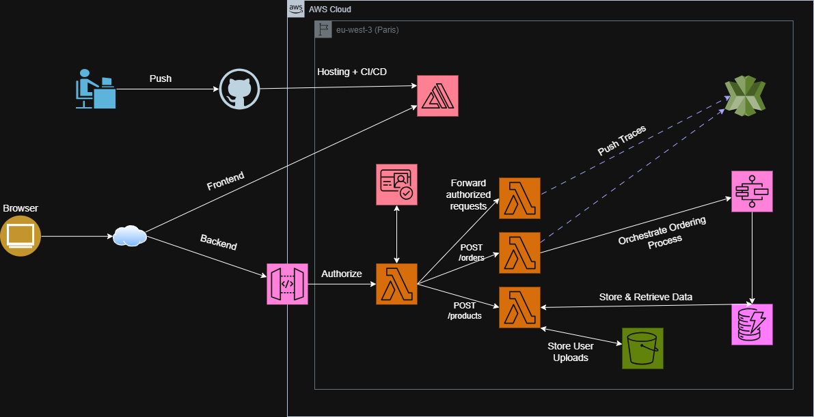

### 1. Frontend Delivery and CI/CD

- Frontend code is pushed to GitHub.
- The repository is connected to AWS Amplify.
- A webhook notifies Amplify after each commit.
- Amplify builds and deploys the frontend automatically, without manual developer intervention.

### 2. Authentication and User Lifecycle

- Authentication is managed with Amazon Cognito User Pools.
- Cognito handles sign-up, sign-in, and hosted authentication UI.
- A PostConfirmation trigger runs a Lambda function after account verification.
- That Lambda registers the new user profile in DynamoDB.

### 3. Backend API Layer

- The frontend calls an HTTP API exposed through API Gateway.
- Protected routes are connected to a Lambda authorizer.
- The authorizer validates user identity and access before forwarding requests.
- Route-specific Lambda handlers implement business logic and return responses.

### 4. Data and Media Storage

- Lambda handlers persist business data in DynamoDB.
- Product creation uses S3 for image storage.
- Image metadata and product records are stored in DynamoDB.

### 5. Order Processing Orchestration

Order creation triggers an AWS Step Functions workflow that coordinates the full transaction lifecycle:

1. Create order
2. Process payment (with retries up to 3 attempts)
3. Evaluate payment result in a Choice state
4. If payment fails, publish a failure message to SNS for the financial team
5. If payment succeeds, trigger inventory update Lambda
6. Evaluate inventory update result in another Choice state
7. Publish success or compensation/refund notification to SNS

This orchestration keeps business flow explicit, resilient, and easy to monitor.

### 6. Security and Reliability Practices

- Lambda functions are granted least-privilege IAM permissions per service action.
- Distributed tracing is enabled with AWS X-Ray.
- Execution and application logs are available in CloudWatch Logs.

These practices improve troubleshooting and reduce operational risk when incidents occur.

## Deployment

Infrastructure provisioning is done with AWS SAM + CloudFormation templates.

### Prerequisites

- AWS CLI installed and configured
- AWS SAM CLI installed
- Access to a GitHub repository containing the frontend code

### Generate a GitHub Token for Amplify

Amplify needs a GitHub token to pull your repository and receive updates after code changes.

1. Open GitHub profile menu and click Settings.
   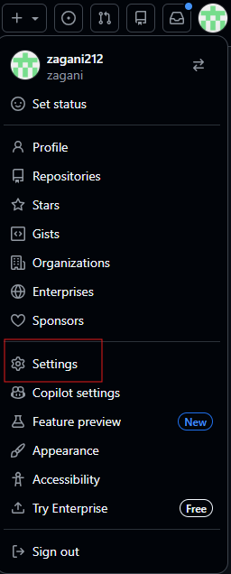

2. In the left sidebar, click Developer settings.
   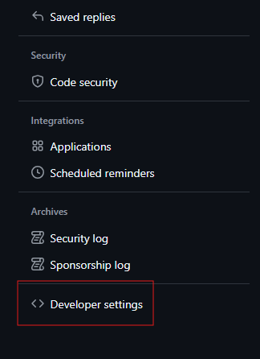

3. Go to Personal access tokens -> Tokens (classic).
   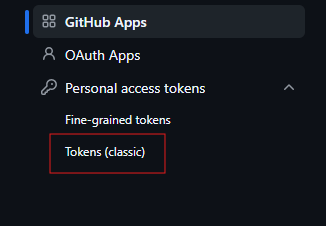

4. Click Generate new token -> Generate new token (classic).
   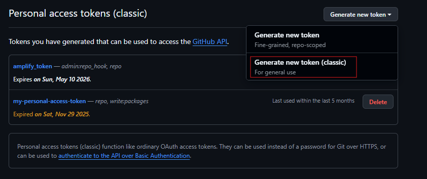

5. Fill token details (name and expiration).
   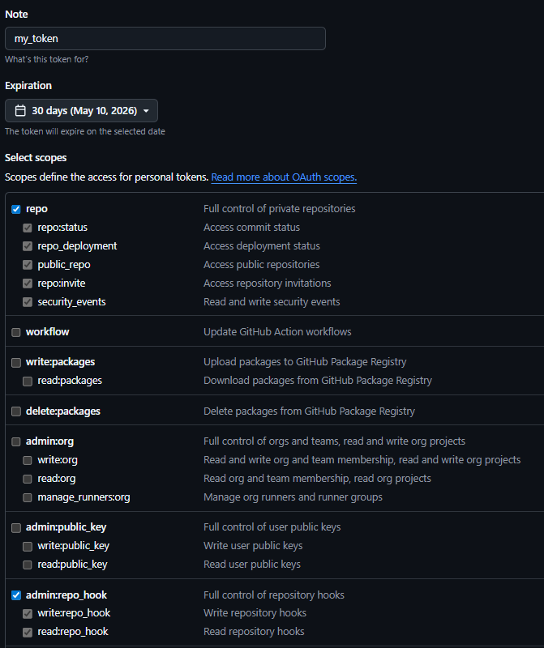

6. Select required scopes:
	- repo
	- admin:repo_hook

7. Click Generate token and copy it immediately.

Important:
- Store the token securely.
- Never commit the token to the repository.

### Deploy All AWS Services

Edit the deploy script placeholders in deploy.sh:

- Replace YOUR_GITHUB_TOKEN with the token generated above.
- Replace YOUR_GITHUB_REPO with your repository HTTPS URL.

Then run:

```bash
bash deploy.sh
```

The script provisions all required components (storage, database, auth, functions, workflow, API, and Amplify branch).

### Delete All AWS Services

To tear down resources, edit delete.sh first:

- Replace YOUR_BUCKET_NAME_HERE with the S3 bucket name used for product images.

Then run:

```bash
bash delete.sh
```

This script deletes all deployed stacks and clears versioned objects in the S3 bucket before removing the bucket stack.

## Optional: AWS Cognito Managed UI for Sign-in/Sign-up

If you want to use Cognito Managed UI instead of the classic hosted UI, follow these steps:

1. In your Cognito User Pool, open Branding -> Managed login.
   Comment: This is where you configure the new managed sign-in/sign-up experience.
   <p align="center">
     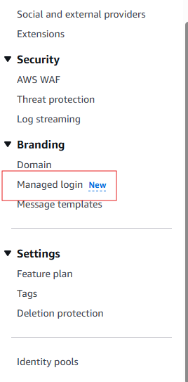
   </p>

2. Select your app client.
   Comment: The style and branding are assigned per app client, so choose the correct one used by your frontend.
   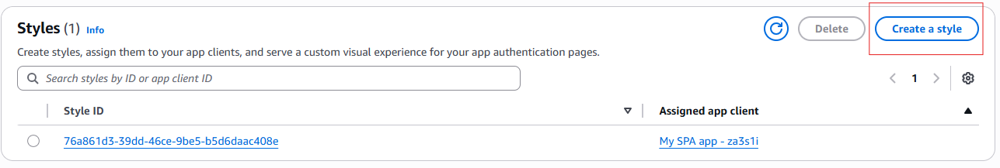

3. Click Create a style.
   Comment: A style lets you customize the visual appearance of Cognito authentication pages.
   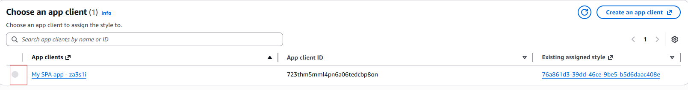

4. In Managed login settings, click Update version.
   Comment: This switches your domain to use the managed login experience.
   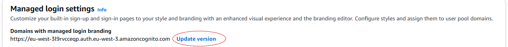

5. Choose Managed login (Recommended), then click Save changes.
   Comment: This activates the new managed UI for your domain.
   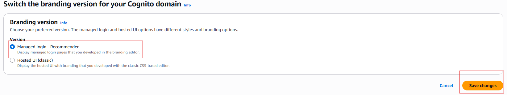
